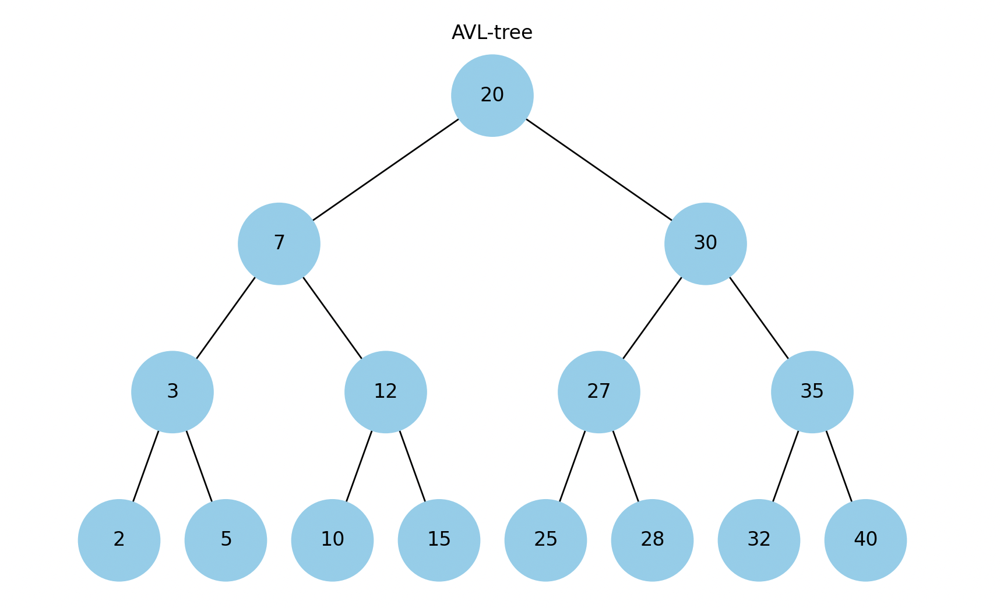
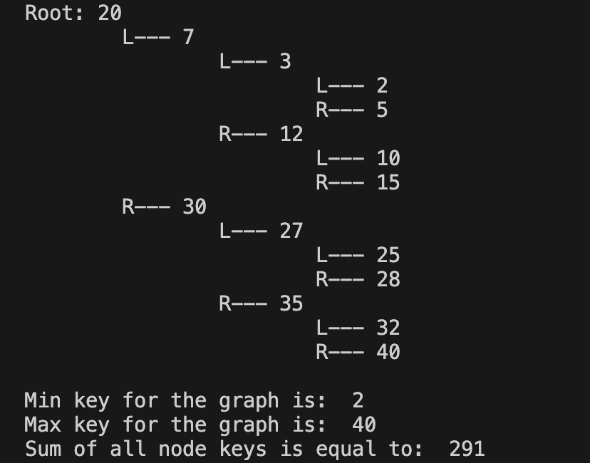

# goit-algo-hw-07

AVL-tree python realisation with basic methods

# AVL-tree

The next picture represents AVL-tree created. We see that it is balanced and all values are distributed in the right order.

There were implemented all basic methods for interaction with binary trees: insertion, search, deletion, min and max value finding, total sum calculation, etc.

